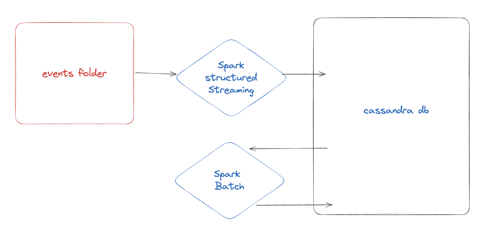
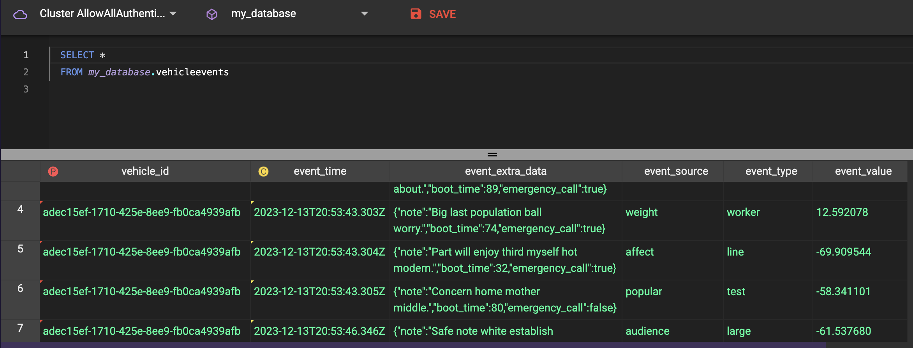
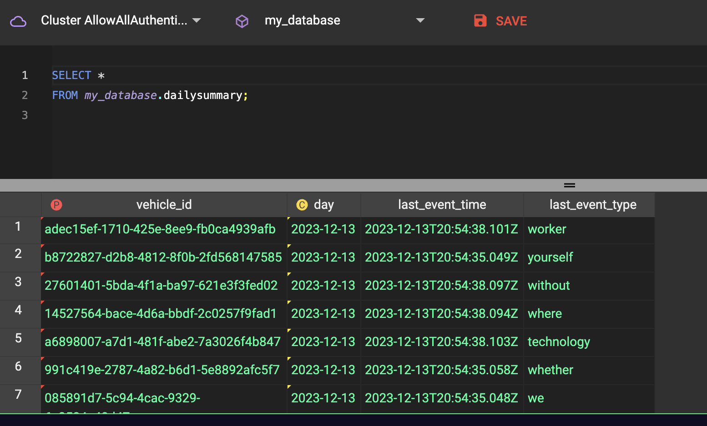

# Lemonade Data Engineering home task

## Description

The task is to build a data pipeline that will process the data from the streaming json files and load it into a database.

The data is generated by a script that simulates a real-time data stream of events from a vehicle data provider. The script generates a json file every 1/2 second and saves it to the `data` folder. 

We have several spark jobs here:
1. spark structured streaming job that reads the data from the `data` folder and writes it to cassandra database.

2. spark batch job that aggregate the data from the last time the batch run and rewrite the aggregated data to the database.




## Why I chose spark

I chose to use spark structured streaming because it's a very powerful tool for streaming data processing. 
It's very easy to use and it's very scalable. It's also very easy to integrate with other data sources and sinks.

In the 2nd step, I could do the aggregation with cassandra sql or materialized view but imho when operations involve complex transformations, aggregations, or if you're dealing with large datasets, leveraging Spark's capabilities could be more efficient despite the additional setup and complexity.

## Why I chose Cassandra

I chose Cassandra because it's a very scalable database and it's very easy to use with spark.
Its optimized for writes and aggregation queries, which is very suitable for this task.


## Getting started
### Pre-requisites

1. Install docker
2. Python 3.7
3. Poetry
4. Java 8

### How to run

1. Setup the cassandra database

    ```bash
    make start-db
    ```

    you should see the following output:

    ```bash
    my_cassandra_server
    43bfb6aba213f404083d680370685ecc9c006e4b4c39c4b78accf64b831d2fb6
    Waiting for Cassandra server [my_cassandra_server] to start
    Cassandra up :)
    created db my_database
    Creating Cassandra tables...
    Cassandra tables created.
    ```

1. Install python project dependencies

    ```bash
    poetry install
    ```

1. Run the Data generation script

    ```bash
    make run-data-gen
    ```

    you should see the following output:

    ```bash
    poetry run python ./scripts/generate-data.py --data-path ./data
    wrote 100 records to ./data/vehicles_events_20231213200547.json
    wrote 100 records to ./data/vehicles_status_20231213200547.json
    wrote 100 records to ./data/vehicles_events_20231213200548.json
    wrote 100 records to ./data/vehicles_status_20231213200548.json
    wrote 100 records to ./data/vehicles_events_20231213200548.json
    ...
    ```

1. copy the dotenv file

    ```bash
    cp .env.example .env
    ```

1. In another Tab, Run the spark streaming job

    ```bash
    make run-spark-ingestion
    ```

    you should see spark streaming job output (not finishing ofcourse, it's streaming...)

1. In another Tab, Run the spark batch job

    ```bash
    make run-spark-daily-batch
    ```

    you should see spark batch job output successful.


## Results

Use Cassandra workbench to query the data.
You should see the data flowing into the database





## How to go to production

Add a pulumi/tf to deploy the infrastructure to the cloud.
there are several options to run spark streaming - EMR, Databricks etc

for the batch job - we can use airflow or any other scheduler,
it will create a spark cluster, run the job and then destroy the cluster.
or alternatively we can use a serverless solution like EMR-serverless.

## Next Steps

1. Add tests
2. Add CI/CD + scheduler + prepare for production
3. Add monitoring
4. Add logging
5. Add more documentation
6. Add more data validation


